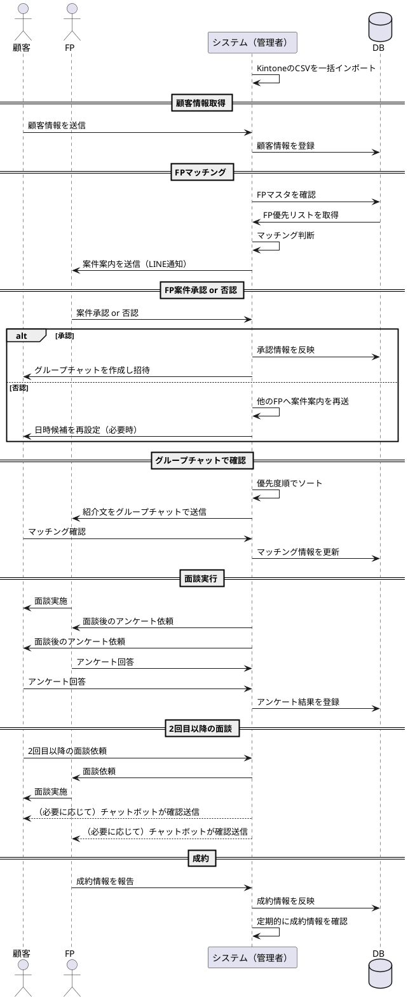

# ユーザーとFPのアテンド業務

```plantuml
@startuml
actor 顧客 as Customer
actor FP as FP
participant "システム（管理者）" as System
database DB as db

System -> System: KintoneのCSVを一括インポート

== 顧客情報取得 ==
Customer -> System: 顧客情報を送信
System -> db: 顧客情報を登録

== FPマッチング ==
System -> db: FPマスタを確認
db -> System: FP優先リストを取得
System -> System: マッチング判断
System -> FP: 案件案内を送信（LINE通知）

== FP案件承認 or 否認 ==
FP -> System: 案件承認 or 否認
alt 承認
    System -> db: 承認情報を反映
    System -> Customer: グループチャットを作成し招待
else 否認
    System -> System: 他のFPへ案件案内を再送
    System -> Customer: 日時候補を再設定（必要時）
end

== グループチャットで確認 ==

System -> System : 優先度順でソート
System -> FP: 紹介文をグループチャットで送信
Customer -> System: マッチング確認
System -> db: マッチング情報を更新

== 面談実行 ==
FP -> Customer: 面談実施
System -> FP: 面談後のアンケート依頼
System -> Customer: 面談後のアンケート依頼
FP -> System: アンケート回答
Customer -> System: アンケート回答
System -> db: アンケート結果を登録

== 2回目以降の面談 ==
Customer -> System: 2回目以降の面談依頼
System -> FP: 面談依頼
FP -> Customer: 面談実施
Customer <-- System : （必要に応じて）チャットボットが確認送信
FP <-- System : （必要に応じて）チャットボットが確認送信

== 成約 ==
FP -> System: 成約情報を報告
System -> db: 成約情報を反映
System -> System: 定期的に成約情報を確認
@enduml
```
