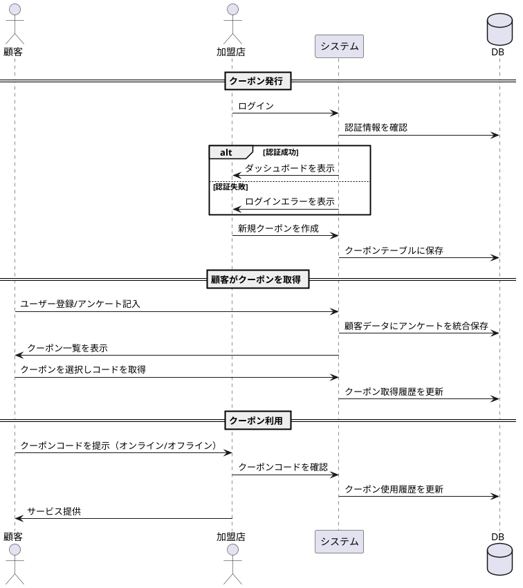

# クーポンの発行と利用

```plantuml
@startuml
actor 顧客 as Customer
actor 加盟店 as Merchant
participant システム as System
database DB as Database

== クーポン発行 ==
Merchant -> System: ログイン
System -> Database: 認証情報を確認
alt 認証成功
    System -> Merchant: ダッシュボードを表示
else 認証失敗
    System -> Merchant: ログインエラーを表示
end

Merchant -> System: 新規クーポンを作成
System -> Database: クーポンテーブルに保存

== 顧客がクーポンを取得 ==
Customer -> System: ユーザー登録/アンケート記入
System -> Database: 顧客データにアンケートを統合保存
System -> Customer: クーポン一覧を表示
Customer -> System: クーポンを選択しコードを取得
System -> Database: クーポン取得履歴を更新

== クーポン利用 ==
Customer -> Merchant: クーポンコードを提示（オンライン/オフライン）
Merchant -> System: クーポンコードを確認
System -> Database: クーポン使用履歴を更新
Merchant -> Customer: サービス提供
@enduml
```
