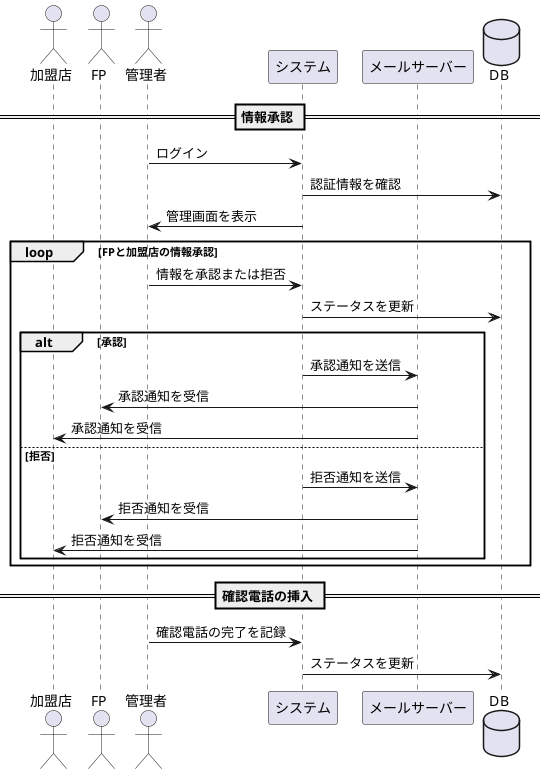

# 管理者による承認とメール送信

```plantuml
@startuml
actor "加盟店" as Merchant
actor "FP" as FP
actor "管理者" as Admin
participant "システム" as System
participant "メールサーバー" as MailServer
database "DB" as Database

== 情報承認 ==
Admin -> System: ログイン
System -> Database: 認証情報を確認
System -> Admin: 管理画面を表示

loop FPと加盟店の情報承認
    Admin -> System: 情報を承認または拒否
    System -> Database: ステータスを更新
    alt 承認
        System -> MailServer: 承認通知を送信
        MailServer -> FP: 承認通知を受信
        MailServer -> Merchant: 承認通知を受信
    else 拒否
        System -> MailServer: 拒否通知を送信
        MailServer -> FP: 拒否通知を受信
        MailServer -> Merchant: 拒否通知を受信
    end
end

== 確認電話の挿入 ==
Admin -> System: 確認電話の完了を記録
System -> Database: ステータスを更新

@enduml
```