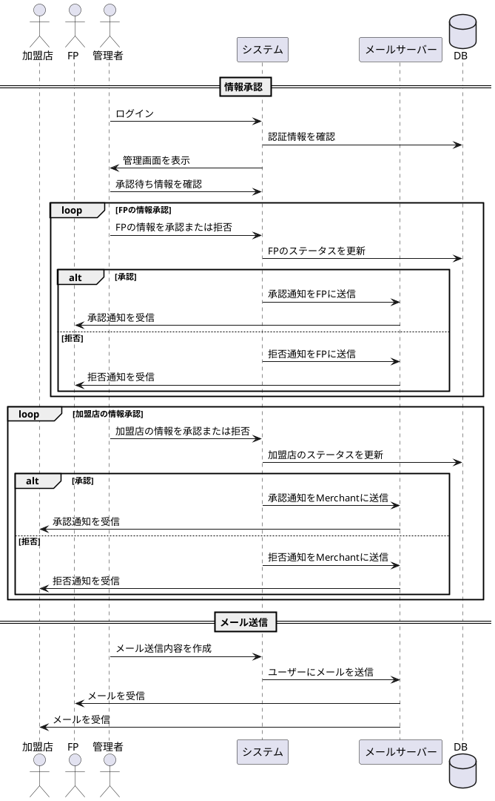

# 管理者による承認とメール送信

```plantuml
@startuml
actor 加盟店 as Merchant
actor FP as FP
actor 管理者 as Admin
participant システム as System
participant メールサーバー as MailServer
database DB as Database

== 情報承認 ==
Admin -> System: ログイン
System -> Database: 認証情報を確認
System -> Admin: 管理画面を表示

Admin -> System: 承認待ち情報を確認

loop FPの情報承認
    Admin -> System: FPの情報を承認または拒否
    System -> Database: FPのステータスを更新
    alt 承認
        System -> MailServer: 承認通知をFPに送信
        MailServer -> FP: 承認通知を受信
    else 拒否
        System -> MailServer: 拒否通知をFPに送信
        MailServer -> FP: 拒否通知を受信
    end
end

loop 加盟店の情報承認
    Admin -> System: 加盟店の情報を承認または拒否
    System -> Database: 加盟店のステータスを更新
    alt 承認
        System -> MailServer: 承認通知をMerchantに送信
        MailServer -> Merchant: 承認通知を受信
    else 拒否
        System -> MailServer: 拒否通知をMerchantに送信
        MailServer -> Merchant: 拒否通知を受信
    end
end

== メール送信 ==
Admin -> System: メール送信内容を作成
System -> MailServer: ユーザーにメールを送信
MailServer -> FP: メールを受信
MailServer -> Merchant: メールを受信

@enduml
```