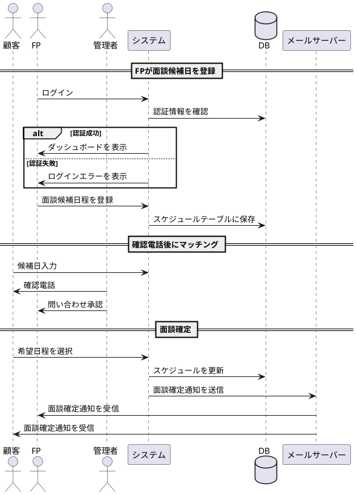

# FPによる日程登録と面談確定

```plantuml
@startuml
actor "顧客" as Customer
actor "FP" as FP
actor "管理者" as Admin
participant "システム" as System
database "DB" as Database
participant "メールサーバー" as MailServer

== FPが面談候補日を登録 ==
FP -> System: ログイン
System -> Database: 認証情報を確認
alt 認証成功
    System -> FP: ダッシュボードを表示
else 認証失敗
    System -> FP: ログインエラーを表示
end

FP -> System: 面談候補日程を登録
System -> Database: スケジュールテーブルに保存

== 確認電話後にマッチング ==
Customer -> System: 候補日入力
Admin -> Customer: 確認電話
Admin -> FP: 問い合わせ承認

== 面談確定 ==
Customer -> System: 希望日程を選択
System -> Database: スケジュールを更新
System -> MailServer: 面談確定通知を送信
MailServer -> FP: 面談確定通知を受信
MailServer -> Customer: 面談確定通知を受信
@enduml
```
