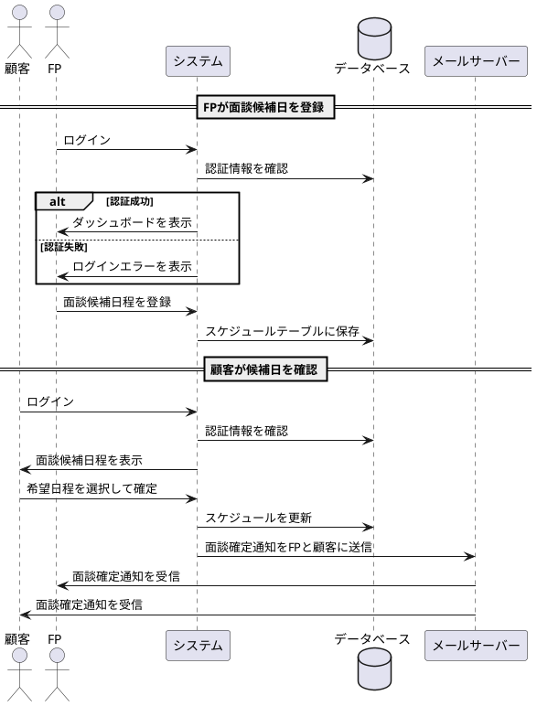

# FPによる日程登録と面談確定

```plantuml
@startuml
actor 顧客 as Customer
actor FP as FP
participant システム as System
database データベース as Database
participant メールサーバー as MailServer

== FPが面談候補日を登録 ==
FP -> System: ログイン
System -> Database: 認証情報を確認
alt 認証成功
    System -> FP: ダッシュボードを表示
else 認証失敗
    System -> FP: ログインエラーを表示
end

FP -> System: 面談候補日程を登録
System -> Database: スケジュールテーブルに保存

== 顧客が候補日を確認 ==
Customer -> System: ログイン
System -> Database: 認証情報を確認
System -> Customer: 面談候補日程を表示
Customer -> System: 希望日程を選択して確定
System -> Database: スケジュールを更新
System -> MailServer: 面談確定通知をFPと顧客に送信
MailServer -> FP: 面談確定通知を受信
MailServer -> Customer: 面談確定通知を受信
@enduml
```