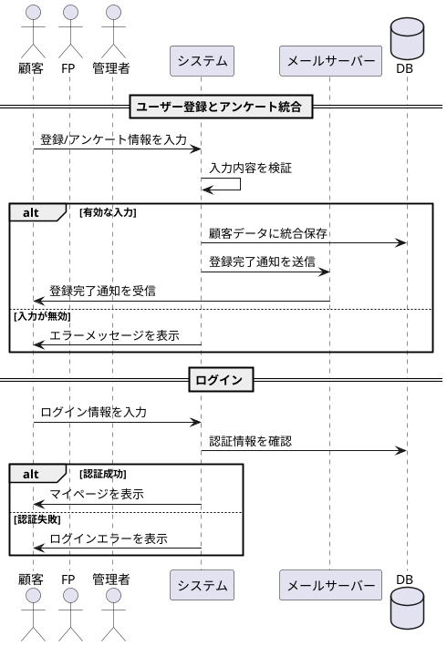

# 顧客のユーザー登録とアンケート提出

```plantuml
@startuml
actor 顧客 as Customer
actor FP as FP
actor 管理者 as Admin
participant システム as System
participant メールサーバー as MailServer
database DB as Database

== ユーザー登録とアンケート統合 ==
Customer -> System: 登録/アンケート情報を入力
System -> System: 入力内容を検証
alt 有効な入力
    System -> Database: 顧客データに統合保存
    System -> MailServer: 登録完了通知を送信
    MailServer -> Customer: 登録完了通知を受信
else 入力が無効
    System -> Customer: エラーメッセージを表示
end

== ログイン ==
Customer -> System: ログイン情報を入力
System -> Database: 認証情報を確認
alt 認証成功
    System -> Customer: マイページを表示
else 認証失敗
    System -> Customer: ログインエラーを表示
end
@enduml
```